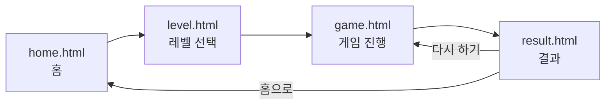
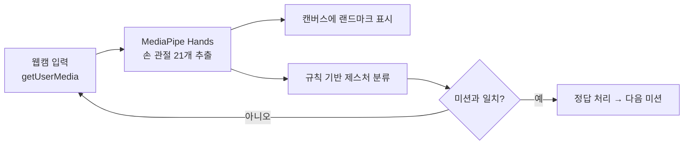

# Hand Spark 👋✨

> 손 모양을 따라 만들며 인지 건강을 지키는 **시니어 친화 손 제스처 게임**

웹캠 앞에서 화면이 제시하는 손 모양(주먹, 손바닥, OK, 브이 등)을 따라 하면,
**MediaPipe Hands**가 손 관절을 인식해 자동으로 정답을 판정합니다.
큰 글씨 · 고대비 · 단순한 흐름으로 디자인해 어르신도 쉽게 사용할 수 있도록 만들었습니다.

---

## 📑 목차
- [주요 기능](#-주요-기능)
- [화면 구성](#-화면-구성)
- [동작 흐름](#-동작-흐름)
- [기술 스택](#-기술-스택)
- [프로젝트 구조](#-프로젝트-구조)
- [시작하기](#-시작하기)
- [게임 방법](#-게임-방법)
- [손동작 인식 원리](#-손동작-인식-원리)
- [데이터 저장](#-데이터-저장)
- [요구 사항 · 주의점](#-요구-사항--주의점)
- [향후 계획](#-향후-계획)

---

## ✨ 주요 기능

- **실시간 손 제스처 인식** — 웹캠 영상에서 손 관절(랜드마크) 21개를 추출해 손 모양을 판별
- **난이도 3단계** — 한 손 기초 → 한 손 심화 → 양손 조합
- **자동 정답 판정** — 미션과 일치하는 손 모양이 잡히면 자동으로 다음 문제로 진행
- **수동 진행 모드** — 카메라 권한이 없거나 인식이 어려우면 버튼으로도 진행 가능 (접근성 보장)
- **기록 통계** — 정답률 · 평균 반응속도 · 소요 시간을 게임 종료 후 시각화
- **시니어 친화 UI** — 큰 폰트, 굵은 검정 테두리, 빨강(`#D32F2F`) 강조, 하단 고정 내비게이션
- **모바일 대응** — 반응형 레이아웃 + 버튼 진동(haptic) 피드백

---

## 🖥 화면 구성

| 페이지 | 파일 | 설명 |
| --- | --- | --- |
| 홈 | `home.html` | 앱 소개, 오늘 날짜, `게임 시작` · `내 기록 보기` 버튼 |
| 레벨 선택 | `level.html` | Lv.1~Lv.3 카드 선택, 선택값을 `localStorage`에 저장 |
| 게임 진행 | `game.html` | 웹캠 + 미션 + 타이머 + 손 인식, 핵심 로직이 담긴 화면 |
| 결과 | `result.html` | 정답 수 · 정답률 · 평균 반응속도 · 소요 시간 요약 |

---

## 🔁 동작 흐름



게임 화면(`game.html`) 내부의 인식 루프는 다음과 같이 동작합니다.



---

## 🛠 기술 스택

- **HTML5 / CSS3 / Vanilla JavaScript** — 프레임워크·번들러 없이 순수 웹 표준으로 구현
- **[MediaPipe Hands](https://developers.google.com/mediapipe)** — 손 관절 랜드마크 추정 (jsDelivr CDN)
- **WebRTC `getUserMedia`** — 웹캠 영상 입력
- **Canvas 2D** — 실시간 랜드마크 시각화
- **Web Storage (`localStorage`)** — 선택 레벨·최근 기록 저장
- **Google Fonts** — Noto Sans, Material Symbols Outlined

> 별도의 서버나 빌드 과정이 없습니다. 정적 파일만으로 동작합니다.

---

## 📂 프로젝트 구조

```
Ossp-main/
└── frontend/
    ├── home.html      # 홈 화면
    ├── level.html     # 레벨 선택
    ├── game.html      # 게임 진행 (웹캠 + 손 인식)
    ├── result.html    # 결과 통계
    └── style.css      # 공통 스타일 (헤더·내비·버튼·타이포)
```

---

## 🚀 시작하기

손 인식을 위한 카메라(`getUserMedia`)는 **보안 컨텍스트(localhost 또는 HTTPS)** 에서만 동작합니다.
`home.html`을 파일로 바로 열면(`file://`) 카메라가 차단될 수 있으니, 아래처럼 로컬 서버로 실행하세요.

```bash
# 저장소 클론
git clone <repository-url>
cd Ossp-main/frontend

# 로컬 서버 실행 (둘 중 하나)
python -m http.server 8000
# 또는
npx serve
```

브라우저에서 접속:

```
http://localhost:8000/home.html
```

처음 게임을 시작하면 **카메라 권한 허용**을 묻습니다. 허용하면 손 인식이 켜집니다.

---

## 🎮 게임 방법

1. 홈에서 **게임 시작** → 레벨을 고릅니다. (기본값 Lv.2)
2. 화면 상단의 **미션 손 모양**을 웹캠 앞에서 따라 만듭니다.
3. 손 모양이 인식되면 **자동으로 다음 문제**로 넘어갑니다.
   - 인식이 잘 안 되면 **`동작했어요`** 버튼으로 직접 통과, **`건너뛰기`** 로 패스할 수 있습니다.
4. 미션마다 **제한 시간**이 있고, 시간이 다 되면 자동으로 다음 문제로 넘어갑니다.
5. 5문제를 마치면 **결과 화면**에서 통계를 확인합니다.

### 레벨 구성

| 레벨 | 이름 | 내용 | 제한 시간(미션당) | 예시 |
| --- | --- | --- | --- | --- |
| **Lv.1** | 한 손 기초 | 한 손 간단한 모양 | 10초 | 주먹, 손바닥, 엄지척, OK, 브이 |
| **Lv.2** | 한 손 심화 | 한 손 복잡한 모양 | 8초 | 전화 모양, 락사인, 손가락 총, 검지 들기, 손하트 |
| **Lv.3** | 양손 조합 | 양손으로 서로 다른 모양 | 6초 | 주먹+손바닥, 엄지척+브이, OK+검지, 양손 하트 |

> 제한 시간은 `max(5, 12 − 레벨×2)` 초로 자동 계산됩니다.

---

## 🤚 손동작 인식 원리

별도의 학습된 분류 모델 없이, **MediaPipe가 추정한 손 관절 좌표를 규칙으로 해석**해 제스처를 판별합니다.

1. **랜드마크 추출** — MediaPipe Hands가 한 손당 21개 관절 좌표를 반환 (최대 2손, 신뢰도 0.65 이상)
2. **손가락 펴짐 판단** — 손가락 끝이 중간 관절보다 위에 있으면 "펴짐"으로 간주
3. **거리 기반 판단** — 엄지–검지 끝 거리, 손바닥 크기 비율 등으로 OK·손하트 등을 구분
4. **제스처 결정** — 펴진 손가락 조합으로 `fist`, `open_palm`, `thumbs_up`, `ok`, `peace`, `call`, `rock`, `point`, `finger_heart` 등을 분류
5. **양손 조합** — Lv.3은 두 손의 제스처 조합(예: `fist` + `open_palm`)이 모두 잡혀야 정답 처리

오인식을 줄이기 위해 정답 자동 판정에는 **1.2초 쿨다운**이 적용됩니다.

---

## 💾 데이터 저장

서버 없이 브라우저 `localStorage`만 사용합니다.

| 키 | 내용 |
| --- | --- |
| `handSparkLevel` | 마지막으로 선택한 레벨 |
| `handSparkLastResult` | 최근 게임 결과(레벨, 정답 수, 소요 시간, 평균 반응속도 등) |

---

## ⚠️ 요구 사항 · 주의점

- **카메라 권한**이 필요하며, **localhost 또는 HTTPS** 환경에서 실행해야 합니다.
- MediaPipe Hands를 **CDN에서 불러오므로 인터넷 연결**이 필요합니다.
- 카메라·라이브러리 로드에 실패하면 자동으로 **수동 진행 모드**로 전환됩니다.
- 데스크톱/모바일의 최신 Chrome 계열 브라우저에서 가장 안정적으로 동작합니다.

---

## 🧭 향후 계획

현재 저장소는 **프론트엔드 프로토타입** 범위입니다. 다음 방향으로 확장할 수 있습니다.

- 규칙 기반 분류 → **학습 기반 손 제스처 인식 모델**(예: YOLO 계열) 로 고도화
- 노인·다양한 환경(조명 변화, 손 떨림, 손 겹침) 데이터로 인식 강건성 강화
- 기록 누적·추세 분석 등 **장기 인지훈련 트래킹** 기능
- 백엔드 연동을 통한 사용자별 기록 동기화

---

<div align="center">

**Hand Spark** · 손을 움직여 뇌를 깨우는 인지훈련 게임 🧠

</div>
